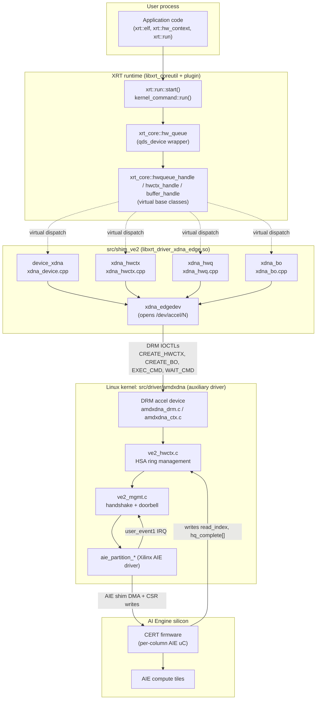
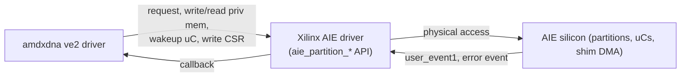

# 01 — Architecture

## Layer diagram



## What runs where

| Thing                                | Lives in                                             | Notes |
|--------------------------------------|------------------------------------------------------|-------|
| ELF parse, control-code patching     | XRT `xrt_module.cpp` (`module_run_aie_gen2_plus`)    | Args are *patched into* the control code, not passed as a separate BO. |
| Build `ert_start_kernel_cmd` + `ert_dpu_data` | XRT `xrt_kernel.cpp` + `xrt_module.cpp`     | Opcode is `ERT_START_DPU` for AIE2PS ELFs. |
| Shim plugin entry points             | `src/shim_ve2/`                                      | All user-visible IOCTLs go through here. |
| HSA queue (`struct hsa_queue`) memory| Kernel `dma_alloc_coherent`                          | Allocated **per hw_ctx** in `ve2_create_host_queue`. |
| Building `host_queue_packet`         | Kernel `ve2_hwctx.c::submit_command[_indirect]`      | Reads cmd BO payload, fills HSA ring, advances `write_index`. |
| Doorbell                             | Kernel `ve2_mgmt.c::notify_fw_cmd_ready`             | `aie_partition_write(0x34008, 0xB6)` on the lead column. |
| Command processor (consumer of ring) | **CERT** firmware on AIE uC                          | Loaded once at probe via `aie_load_cert_broadcast` from `amdnpu/release_cert_ve2.elf`. |
| AIE program execution                | AIE compute tiles                                    | CERT dispatches `exec_buf.dpu_control_code_*` to the AIE engine. |
| Completion signal                    | CERT writes `hq_complete[]` + bumps `read_index`     | Then raises `user_event1` → kernel IRQ. |
| Wake/poll on completion              | Kernel `ve2_cmd_wait` waits on `read_index > seq`    | `DRM_IOCTL_AMDXDNA_WAIT_CMD` blocks in this. |

## Does ve2 use CERT? (Yes.)

**CERT** = the AIE microcontroller firmware that acts as the **on-device command processor** for the host queue. On ve2 it is loaded once at driver probe time:

```9:13:src/driver/amdxdna/ve2_regs.c
const struct amdxdna_dev_priv ve2_dev_priv = {
	.fw_path	= "amdnpu/release_cert_ve2.elf",
	.hwctx_limit	= 255,
	.ctx_limit	= 255,
};
```

```24:36:src/driver/amdxdna/ve2_of.c
	ret = request_firmware(&fw, xdna_hdl->priv->fw_path, xdna->ddev.dev);
	if (ret) {
		XDNA_ERR(xdna, "request fw %s failed %d", xdna_hdl->priv->fw_path, ret);
		return -ENODEV;
	}
	...
	ret = aie_load_cert_broadcast(xaie_dev, buf);
```

Per-context handshake state (which CERT polls) is maintained in privileged AIE memory — see `struct handshake` in `src/driver/amdxdna/ve2_host_queue.h` (fields like `cert_idle_status`, `runlist_read_idx`, counters `c_hsa_pkt`, `c_doorbell`).

## Where the management plane sits

Unlike PCI npu* (PCI BAR + MSI-X) and T20 (RPMsg/SHMEM), the **ve2 management plane is the Xilinx AIE driver itself** (`linux/xlnx-ai-engine.h` / `aie_partition_*` API). The amdxdna driver **does not own the AIE registers** — it borrows the Xilinx driver's partition API to:

- Request a partition (`aie_partition_request`) and register a completion callback (`user_event1_complete = ve2_irq_handler`).
- Read/write privileged AIE memory for handshake (`ve2_partition_{read,write}_privileged_mem`).
- Wake CERT uCs (`aie_partition_uc_wakeup`).
- Write the AIE "shim event-generate" CSR (`aie_partition_write` to `0x34008`) — this is the **doorbell**.
- Receive AIE error events (`aie_register_error_notification` → `ve2_aie_error_cb`).



## Comparison with the other variants

| Aspect            | **VE2 (this doc)**                          | **PCI npu1/3/4 (aie4_pci)**                       | **T20 (npu3_aie2ps)**                       |
|-------------------|---------------------------------------------|---------------------------------------------------|---------------------------------------------|
| Bus               | Auxiliary device (`xilinx_aie.amdxdna`)     | PCIe                                              | Platform device (DT)                        |
| Mgmt transport    | AIE partition API + handshake memory        | PCI BAR + MSI-X + CERT `aie4` mailbox             | RPMsg or SHMEM mailbox (npu3 protocol)      |
| Doorbell          | AIE shim event reg `0x34008` ← `0xB6`       | PCI BAR doorbell write                            | RPMsg msg `opcode=0` (proposed: dataplane type) or SHMEM IPI |
| Cmd processor     | CERT on AIE uC                              | CERT on dedicated NPU uC                          | CERT on RPU (firmware emulates aie4 protocol) |
| HSA queue         | Kernel `dma_alloc_coherent`, per-hw_ctx     | Kernel allocates UMQ BO; user mode submission optional | Per-hw_ctx UMQ BO; same aie4 layout       |
| Completion        | CERT bumps `read_index` → user_event1 IRQ   | CERT bumps `read_index` → MSI-X                   | CERT bumps `read_index` (poll, no IRQ today)|
| dma_fence signal? | **Not signaled** by ve2 (`amdxdna_drm_wait_cmd` blocks instead) | Signaled in `aie4_hwctx`              | Signaled in `aie4_hwctx`                    |
| ELF/xclbin load   | `register_xclbin` is a no-op in shim        | xclbin loaded into HW via firmware                | Same as ve2 — register-only                 |

## Why the ve2 design looks "thinner" than the PCI design

- **No separate firmware mailbox** — handshake-style shared memory + `aie_partition_write` is enough because the Xilinx AIE driver already arbitrates physical access.
- **No per-message ack** — CERT consumes the ring at its own pace; the host learns about progress only via `read_index` and `hq_complete[]`.
- **No BAR doorbell map exposed to userspace** — all kicks go through DRM ioctls.

This is the same conceptual model the **T20 npu3_aie2ps** variant adopts — the difference is only that on T20 the kernel cannot poke AIE registers directly (no Xilinx AIE driver in this transport), so it routes the doorbell through RPMsg / SHMEM to the **RPU**, which then turns around and pokes the equivalent CSR or feeds CERT.
