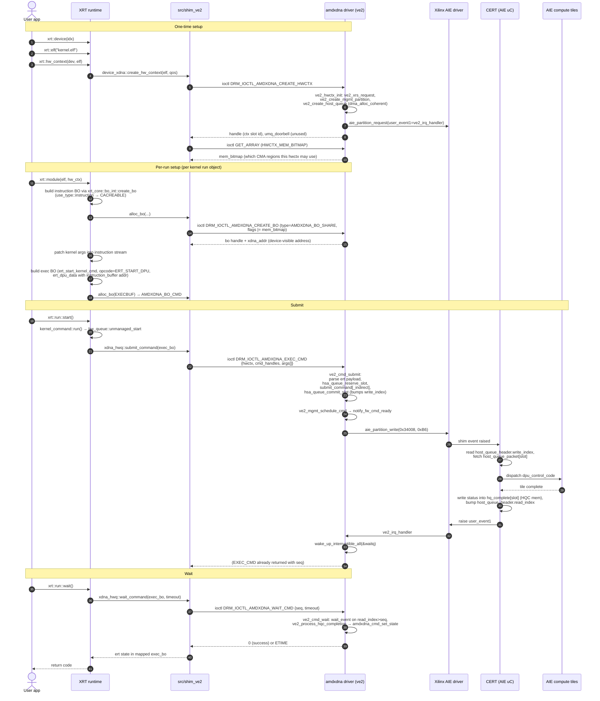

# 02 — End-to-End Submit Flow

This is the `xrt::run::start()` → AIE-tile-execution → `wait()` round-trip, layer by layer, with verifiable file/line citations.

## High-level sequence

## Step-by-step with citations

### Phase A — Open device & create hw_ctx

| # | Layer | Code | What happens |
|---|-------|------|--------------|
| A1| App  |      | `xrt::device(idx)` → `system_linux.cpp` registers ve2/edge probe path. |
| A2| Shim | `src/shim_ve2/drv_xdna.cpp:31-77 scan_devices` | Walks `/sys/class/accel/accel*`, matches `device/driver` symlink containing `amdxdna`, then verifies `/dev/accel/<n>` exists. |
| A3| Shim | `src/shim_ve2/xdna_edgedev.cpp:204-249 get_edgedev/open` | Opens `/dev/accel/<n>` `O_RDWR` once per process. |
| A4| Shim | `src/shim_ve2/xdna_device.cpp:1029-1035 device_xdna::device_xdna` | Constructs the core device object; calls `m_edev->open()`. |
| A5| App  |      | `xrt::hw_context(dev, elf, qos)`. |
| A6| XRT  | `xrt/src/runtime_src/core/common/api/xrt_hw_context.cpp:295-307` | Builds `hw_context_impl`, calls `m_core_device->create_hw_context(elf, ...)`. |
| A7| Shim | `src/shim_ve2/xdna_device.cpp:1096-1118 create_hw_context` | Constructs `xdna_hwctx`. |
| A8| Shim | `src/shim_ve2/xdna_hwctx.cpp:100-134` | Issues `DRM_IOCTL_AMDXDNA_CREATE_HWCTX` with `qos_p`, `num_tiles`. |
| A9| Drv  | `src/driver/amdxdna/amdxdna_ctx.c:90-149 amdxdna_drm_create_hwctx_ioctl` | Allocates `amdxdna_ctx`, calls `ops->ctx_init` → `ve2_hwctx_init`. |
| A10| Drv | `src/driver/amdxdna/ve2_hwctx.c:1401-1468 ve2_hwctx_init` | `ve2_xrs_request` → `ve2_create_mgmt_partition` (registers `user_event1_complete = ve2_irq_handler`); `ve2_auto_select_mem_bitmap`; `ve2_create_host_queue` (DMA-coherent allocation). |
| A11| Drv | `src/driver/amdxdna/ve2_mgmt.c:42-69 cert_setup_partition` | Writes `mpaie_alive`, log/dbg/trace addresses, **`hsa_addr_high/low` (queue base)** into the CERT handshake region for the lead column. |
| A12| Drv | returns `args->handle = ctx->id`; `umq_doorbell` is left at `AMDXDNA_INVALID_DOORBELL_OFFSET`. |
| A13| Shim | `src/shim_ve2/xdna_hwctx.cpp:247-267 query_mem_bitmap` | Issues `DRM_IOCTL_AMDXDNA_GET_ARRAY` with `DRM_AMDXDNA_HWCTX_MEM_BITMAP` — caches `m_mem_bitmap` for later BO allocations. |

### Phase B — Allocate buffers (instruction code, exec BO, args)

| # | Layer | Code | What happens |
|---|-------|------|--------------|
| B1| XRT  | `xrt/src/runtime_src/core/common/api/xrt_module.cpp:932-951 module_run_aie_gen2_plus::create_instruction_buffer` | Calls `xrt_core::bo_int::create_bo(hwctx, sz, use_type::instruction)`. |
| B2| XRT  | `xrt/src/runtime_src/core/common/api/xrt_bo.cpp:1724-1732 compose_internal_bo_flags` | `instruction` → `XRT_BO_FLAGS_CACHEABLE`. |
| B3| Shim | `src/shim_ve2/xdna_device.cpp:49-64 flag_to_type` | `CACHEABLE` → `AMDXDNA_BO_SHARE`. |
| B4| Shim | `src/shim_ve2/xdna_hwctx.cpp:355-370 alloc_bo` | Forwards `m_mem_bitmap` into low bits of `xcl_bo_flags.bank`. |
| B5| Shim | `src/shim_ve2/xdna_bo.cpp:225-243 alloc_bo` | Builds `amdxdna_drm_create_bo` with `flags = mem_bitmap`, `type = AMDXDNA_BO_SHARE`, `size = sz`. |
| B6| Drv  | `src/driver/amdxdna/amdxdna_gem.c amdxdna_drm_create_share_bo` (CMA path) | Picks the first set bit in `flags & 0xFF`, calls `dma_alloc_coherent` (or `dma_alloc_wc`) on the matching `cma_region_devs[i]`. Returns BO handle + dma address. |
| B7| Shim | `src/shim_ve2/xdna_bo.cpp:454-475 mmap_bo` | mmaps the BO into user VA via DRM gem offset. |
| B8| XRT  | `xrt/src/runtime_src/core/common/api/xrt_module.cpp` patch helpers | Patches kernel arguments **into the control-code stream** (no separate args BO needed). |
| B9| XRT  | `xrt/src/runtime_src/core/common/api/xrt_kernel.cpp:714-718` | Allocates exec BO via `bo_cache::alloc_bo<ert_start_kernel_cmd>(XCL_BO_FLAGS_EXECBUF)`. |
| B10| Shim | `src/shim_ve2/xdna_device.cpp:49-64 flag_to_type` | `EXECBUF` → `AMDXDNA_BO_CMD`. |

### Phase C — Build the exec packet

| # | Layer | Code | What happens |
|---|-------|------|--------------|
| C1| XRT  | `xrt/src/runtime_src/core/common/api/xrt_module.cpp:1000-1036 module_run_aie_gen2_plus::fill_ert_dpu_data` | Fills one `ert_dpu_data` per UC: `instruction_buffer = <device addr of instr BO>`, `instruction_buffer_size`, `uc_index`, `chained` (number of additional UCs). |
| C2| XRT  | `xrt/src/runtime_src/core/common/api/xrt_kernel.cpp` | `cmd->set_opcode(ERT_START_DPU)`. |
| C3| Shim | `src/shim_ve2/xdna_bo.cpp:314-342 bind_at` | Records arg BO DRM handles into `xdna_bo` so they can travel as the `args[]` array of `amdxdna_drm_exec_cmd`. |

### Phase D — Submit

| # | Layer | Code | What happens |
|---|-------|------|--------------|
| D1| App  |      | `xrt::run::start()`. |
| D2| XRT  | `xrt/src/runtime_src/core/common/api/xrt_kernel.cpp:2775-2794 run_impl::start` | Calls `kernel_command::run()`. |
| D3| XRT  | `xrt_kernel.cpp:866-891 kernel_command::run` | Calls `m_hwqueue.unmanaged_start(this)`. |
| D4| XRT  | `xrt/src/runtime_src/core/common/api/hw_queue.cpp:431-534 qds_device::submit` | Calls `m_qhdl->submit_command(cmd->get_exec_bo())`. |
| D5| Shim | `src/shim_ve2/xdna_hwq.cpp:50-87 submit_command` | Builds `amdxdna_drm_exec_cmd` with `hwctx`, `cmd_handles`, `args = arg_bo_hdls`, issues `DRM_IOCTL_AMDXDNA_EXEC_CMD`. |
| D6| Drv  | `amdxdna_ctx.c amdxdna_drm_submit_execbuf → amdxdna_cmd_submit` | Allocates `amdxdna_sched_job`, `dma_fence`, looks up ctx, calls `ops->cmd_submit` → `ve2_cmd_submit`. |
| D7| Drv  | `src/driver/amdxdna/ve2_hwctx.c:939-979 ve2_cmd_submit` | Validates opcode is `ERT_START_DPU` or `ERT_CMD_CHAIN`, decodes `ert_start_kernel_cmd → ert_dpu_data`, calls `ve2_submit_cmd_single` or `ve2_submit_cmd_chain`. |
| D8| Drv  | `ve2_hwctx.c hsa_queue_reserve_slot` | Reserves `reserved_write_index`, primes `hq_complete[slot] = ERT_CMD_STATE_NEW`, returns the `host_queue_packet *`. |
| D9| Drv  | `ve2_hwctx.c submit_command` (or `submit_command_indirect`) | Fills `host_queue_packet.xrt_header` (opcode `EXEC_BUF`, chain flag, **`completion_signal = hq_complete[slot] dma addr`**) and `pkt.data[]` (direct: a single `exec_buf` with `instruction_buffer` addrs; indirect: an `host_indirect_packet_entry` pointing at `hq_indirect_hdr[slot]`). `dma_sync_single_for_device`. |
| D10| Drv | `ve2_hwctx.c hsa_queue_commit_slot` | Marks packet valid, sets `hq_complete[slot] = SUBMITTED`, advances `host_queue_header.write_index` (skipping any earlier reserved-but-unfilled slots). |
| D11| Drv | `src/driver/amdxdna/ve2_hwctx.c ve2_hwctx_add_job` | Stashes `pending[slot] = job`, `submitted++`. |
| D12| Drv | `src/driver/amdxdna/ve2_mgmt.c ve2_mgmt_schedule_cmd` | FIFO enqueues; on first/context-switch, `ve2_mgmt_handshake_init`. |
| D13| Drv | `src/driver/amdxdna/ve2_mgmt.c:1393-1413 notify_fw_cmd_ready` | `ve2_partition_write(VE2_EVENT_GENERATE_REG=0x34008, value=VE2_USER_EVENT_ID=0xB6)`. |
| D14| Drv | returns `args->seq` to userspace. |
| D15| Shim | `xdna_hwq.cpp:85-86 set_cmd_id` | Stores `seq` on the cmd BO. |

### Phase E — On-device execution

| # | Layer | What happens |
|---|-------|--------------|
| E1| CERT  | Sees event 0xB6, reads `host_queue_header.write_index`. |
| E2| CERT  | Walks `hq_entry[(write_index-1) % capacity]`; honors `chain_flag` to consume multiple packets in a chain. |
| E3| CERT  | For `EXEC_BUF` direct: reads `exec_buf` from `pkt.data`. For indirect (`pkt.indirect == 1`): reads `host_queue_indirect_hdr[slot]`, walks each `host_indirect_packet_entry` to find per-UC `host_queue_indirect_pkt`. |
| E4| CERT  | Loads each UC's `dpu_control_code` from DRAM (the BO whose dev addr we put in `exec_buf.dpu_control_code_*`). |
| E5| CERT  | Programs AIE shim DMAs and dispatches the DPU control code on the AIE compute tiles. |
| E6| CERT  | When all chained sub-cmds are done: writes status word to `xrt_header.completion_signal` (HQC slot dma addr); bumps `host_queue_header.read_index`. |
| E7| CERT  | Raises AIE shim event → `user_event1`. |

### Phase F — Wait & return

| # | Layer | Code | What happens |
|---|-------|------|--------------|
| F1| XAIE | (interrupt path)                                                | Routes user_event1 to the registered `user_event1_complete` callback. |
| F2| Drv  | `src/driver/amdxdna/ve2_mgmt.c:742 ve2_irq_handler`            | Reads queue indices, drains the per-ctx FIFO, `wake_up_interruptible_all(&waitq)`, may queue `ve2_scheduler_work`. |
| F3| App  |                                                                 | `xrt::run::wait()` (or `xrt::run::wait(timeout)`). |
| F4| XRT  | `xrt/src/runtime_src/core/common/api/hw_queue.cpp:464-484 qds_device::wait` | Calls `m_qhdl->wait_command(exec_bo, timeout_ms)`. |
| F5| Shim | `src/shim_ve2/xdna_hwq.cpp:90-134 wait_command`                | Issues `DRM_IOCTL_AMDXDNA_WAIT_CMD` with `seq`, `timeout`. |
| F6| Drv  | `src/driver/amdxdna/ve2_hwctx.c:1291-1374 ve2_cmd_wait`        | `wait_event_*` with predicate `check_read_index(read_index > seq)`. On completion: `ve2_process_hqc_completion` reads `hq_complete[slot]` (CERT-written state), maps to `ERT_CMD_STATE_*`, calls `amdxdna_cmd_set_state` on the cmd BO. |
| F7| Drv  | returns 0 (or `-ETIME`).                                        |
| F8| XRT  | `qds_device::wait`                                              | Reads `ERT_CMD_STATE_*` directly from the mapped exec packet on the cmd BO. |
| F9| App  |                                                                 | Receives normal/error result. |

## Notes on what is and is not used today

- **`umq_doorbell` returned from `CREATE_HWCTX` is not meaningful on ve2.** The kernel never sets `ctx->doorbell_offset`, so the shim sees `AMDXDNA_INVALID_DOORBELL_OFFSET`. There is no userspace doorbell mmap on ve2 — submission is always kernel-mediated through `EXEC_CMD`.
- **`syncobj_handle` and the optional dependency/signal extension fields of `amdxdna_drm_exec_cmd` are not wired**. `xdna_hwq` does not pass a syncobj, and the ve2 driver does not call `dma_fence_signal` on the job fence (intentionally — it relies on `WAIT_CMD` blocking).
- **`load_axlf` / `register_xclbin` / `exec_buf` are unsupported**. `device_xdna` inherits the `noshim` template's "throws not_supported" stubs for these (`xrt/src/runtime_src/core/common/shim/ishim.h:493-508`). xclbin metadata is only cached in-process; nothing is downloaded to the device.
- **Args are not a separate BO**. XRT patches them into the control code; `args_len` in `exec_buf` is forced to 0 in `ve2_hwctx.c::submit_command` (≈ lines 732-734).
