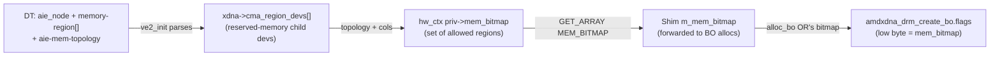
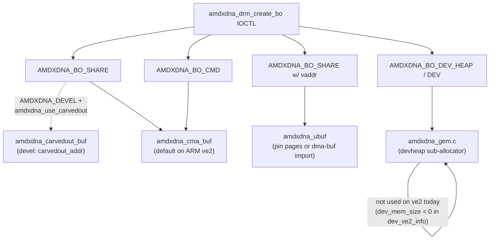

# 03 — Memory Model

ve2 has **no IOMMU SVA** path (`AMDXDNA_IOMMU_NO_PASID`, `xdna->domain == NULL`), so all device-visible memory is either **DMA-coherent / contiguous CMA**, **carved-out reserved physical memory**, or a **pinned userptr that happens to be physically contiguous**. There is no scatter-gather to the AIE side.

## Memory regions, banks, and `mem_bitmap`

### Where memory regions come from

The AIE node in DT carries a list of reserved memory phandles, plus a sibling **topology** node that maps AIE column ranges to bitmaps over those regions:

```125:161:src/driver/amdxdna/ve2_of.c
	num_regions = of_count_phandle_with_args(aie_np, "memory-region", NULL);
	...
		ret = of_reserved_mem_device_init_by_idx(child_dev, aie_np, i);
		...
		xdna->cma_region_devs[i] = child_dev;
```

```172:185:src/driver/amdxdna/ve2_of.c
static struct device_node *ve2_find_mem_topology_node(struct device_node *aie_np)
{
	...
	for_each_child_of_node(aie_np->parent, node) {
		if (of_device_is_compatible(node, "xlnx,aie-mem-topology"))
			return node;
```

Each `memory-region` becomes an entry in `xdna->cma_region_devs[]`, indexed `0..MAX_MEM_REGIONS-1`. A reserved-memory device is bound per-index so DMA APIs can target a specific pool.

### How a hw_ctx picks regions

When a hw_ctx is created, the driver looks at the AIE column range it will run on, walks the topology table, and computes `priv->mem_bitmap` — the set of region indices this hw_ctx is allowed to allocate from (`ve2_auto_select_mem_bitmap`). This bitmap is returned to userspace via:

```text
DRM_IOCTL_AMDXDNA_GET_ARRAY  param=DRM_AMDXDNA_HWCTX_MEM_BITMAP
```



### How the shim turns it into BO flags

In `xdna_hwctx::alloc_bo`:

```text
xcl_bo_flags.bank = m_mem_bitmap          (when use_type != 0)
xcl_bo_flags.bank = 1U << bank_index      (external user BO with explicit bank index)
```

In `xdna_bo::alloc_bo` the bitmap ends up in low bits of `amdxdna_drm_create_bo.flags`:

```232:248:src/driver/amdxdna/amdxdna_cma_buf.c
	mem_bitmap = (u32)(flags & 0xFFULL);
	for (i = 0; i < max_regions; i++) {
		if ((mem_bitmap & (1U << i)) && region_devs[i]) {
			dma_buf = amdxdna_get_cma_buf(region_devs[i], size, cacheable);
```

The kernel tries each set bit in order until one succeeds.

### What the user-visible "group_id" maps to

XRT's `xrt::bo` group_id is the xclbin connectivity index — but ve2 does **not** publish a memory topology xclbin section. Internal allocations (`use_type::instruction`, `scratch_pad`) use the **hwctx's `mem_bitmap`** directly. External user BOs that take an explicit `bank_index` get `(1U << bank_index)` packed into flags — so a user passing group 0 ends up restricted to region 0, group 1 to region 1, etc. The shim's `device_xdna::get_info` reports `mDDRBankCount = 1` as a placeholder; there is no rich xrt-info topology surface today.

## BO backends

`src/driver/amdxdna` ships several BO-backing implementations. Which one is used depends on the BO type and build flags.



### `amdxdna_cma_buf.c` — primary backend

- Backed by `dma_alloc_coherent` (or `dma_alloc_wc` for write-combine) on the per-region device picked from `mem_bitmap`.
- Returned `dma_addr` is the device-visible address used in `host_queue_packet.exec_buf` fields.
- `amdxdna_get_cma_buf_with_fallback` walks the `mem_bitmap` and falls back to `xdna->ddev.dev` if no region accepts the alloc — this means the BO ends up in the system DMA pool rather than a partition-specific carveout.

### `amdxdna_carvedout_buf.c` — devel-only

- Compiled when `#ifdef AMDXDNA_DEVEL` and the user sets module params `carvedout_addr` / `carvedout_size`.
- Single `drm_mm` arena over a fixed physical range; uses `dma_map_resource` and PFN mmap.
- Bypasses CMA — the device sees a bus/phys mapping. Useful for bring-up before DT carveouts are wired.

### `amdxdna_ubuf.c` — userptr / dma-buf import

- Triggered when `amdxdna_drm_create_bo.vaddr != 0` (or a `flags & AMDXDNA_BO_USERPTR_DMABUF`).
- Pins user pages, builds an SG table, attaches with `dma_map_sgtable`.
- The driver assumes the SG list collapses to a single contiguous DMA address (`amdxdna_devel.c:108-131`) since there is no IOMMU; if the userptr is fragmented, this assertion breaks.

### `amdxdna_gem.c` device-heap (DEV_HEAP/DEV) — **not used on ve2**

- The classical "carve a big device-heap BO and sub-allocate" model used by some PCI parts.
- `dev_ve2_info.dev_mem_size = 0`, so dev-heap is effectively disabled on ve2.

## Memory layout per BO class

| BO class                                 | Backend on ve2                                  | Where the device-physical address ends up |
|------------------------------------------|--------------------------------------------------|-------------------------------------------|
| **HSA queue** (`struct hsa_queue`)       | Kernel `dma_alloc_coherent` on a region from `priv->mem_bitmap` (or fallback to system DMA pool) | Stored as `hsa_addr_high/low` in the **CERT handshake** for the lead column (`ve2_mgmt.c::cert_setup_partition`). |
| **DPU instruction / control code BO**    | `AMDXDNA_BO_SHARE` via CMA (or carvedout)        | User code embeds it in `ert_dpu_data.instruction_buffer`; kernel copies into `exec_buf.dpu_control_code_*`. |
| **Args BO**                              | *Not allocated today.* Args are patched into the control code by `xrt::module`. | `args_len = 0` in `exec_buf`. |
| **Scratch pad**                          | `AMDXDNA_BO_SHARE` from `xrt_core::bo_int::create_bo(use_type::scratch_pad)` | Patched into control code as another address. |
| **Cmd / exec BO**                        | `AMDXDNA_BO_CMD` from CMA                        | Holds `ert_start_kernel_cmd` for kernel parsing; kernel reads opcode + `ert_dpu_data` from it. The cmd BO itself is **not** placed in the HSA ring — only its parsed contents are. |
| **Debug / log / trace BO**               | `AMDXDNA_BO_SHARE` then attached via `DRM_IOCTL_AMDXDNA_CONFIG_HWCTX (DRM_AMDXDNA_HWCTX_ASSIGN_DBG_BUF)` | Kernel writes BO dma addr into per-column CERT handshake (`ve2_config_hwctx`). |

## HSA queue allocation in detail

```493:541:src/driver/amdxdna/ve2_hwctx.c
static int ve2_create_host_queue(struct amdxdna_dev *xdna, struct amdxdna_ctx *hwctx,
				 struct ve2_hsa_queue *queue)
{
	int nslots = HOST_QUEUE_ENTRY;
	...
	alloc_size = sizeof(struct hsa_queue) + sizeof(u64) * nslots;
	...
	for (r = 0; r < MAX_MEM_REGIONS; r++) {
		alloc_dev = xdna->cma_region_devs[r];
		if ((hwctx->priv->mem_bitmap & (1U << r)) && alloc_dev) {
			queue->hsa_queue_p = dma_alloc_coherent(alloc_dev, alloc_size,
								&dma_handle, GFP_KERNEL);
			...
		}
	}
	if (!queue->hsa_queue_p) {
		queue->hsa_queue_p = dma_alloc_coherent(xdna->ddev.dev,
							alloc_size,
							&dma_handle,
							GFP_KERNEL);
```

Key points:

- One contiguous allocation per hw_ctx covers `struct hsa_queue` + a tail of `HOST_QUEUE_ENTRY` × `u64` words used as **HQC** (host-queue completion status). The HQC tail is **not** part of `struct hsa_queue` proper — it's an adjacent companion array reachable via `hq_complete.hqc_dma_addr`.
- The chosen allocation device determines the **physical address** the AIE side will see. Picking from `mem_bitmap` means CERT only ever needs to access addresses inside the carveouts assigned to its partition (important for IOMMU-less / bus-master constrained environments).
- The dma address is **never** exposed to userspace; only the CERT firmware on the AIE uC sees it (via the handshake region).

## What the shim actually allocates

The `xdna_hwq` itself stores `m_queue_boh = AMDXDNA_INVALID_BO_HANDLE` and never assigns it (`xdna_hwq.cpp:10-15, 43-46`). There is no user-mode submission ring on ve2 — every kick crosses the kernel via `EXEC_CMD`. This is the cleanest demonstration that the entire HSA queue is a kernel/CERT-private artifact in this design.

## Why this matters for T20

T20 (`npu3_aie2ps`) starts from this same model — kernel owns the HSA queue, CERT consumes it — but **the kernel cannot `dma_alloc_coherent` on AIE-private memory** because it doesn't own the AIE driver. Instead it allocates the UMQ BO out of `dev_npu3_aie2ps_info.dev_mem_size` (currently the npu3 device-heap), and tells the RPU FW the device address via `CREATE_HW_CONTEXT.hsa_addr_high/low` (the same field as ve2's CERT handshake, just delivered over RPMsg). The doorbell, instead of `aie_partition_write(0x34008, 0xB6)`, becomes a fire-and-forget RPMsg the RPU FW translates into the equivalent CSR poke.
