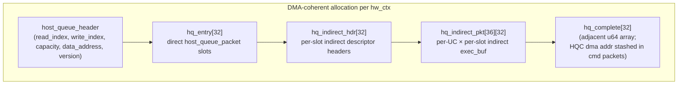
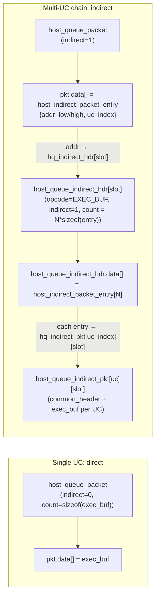
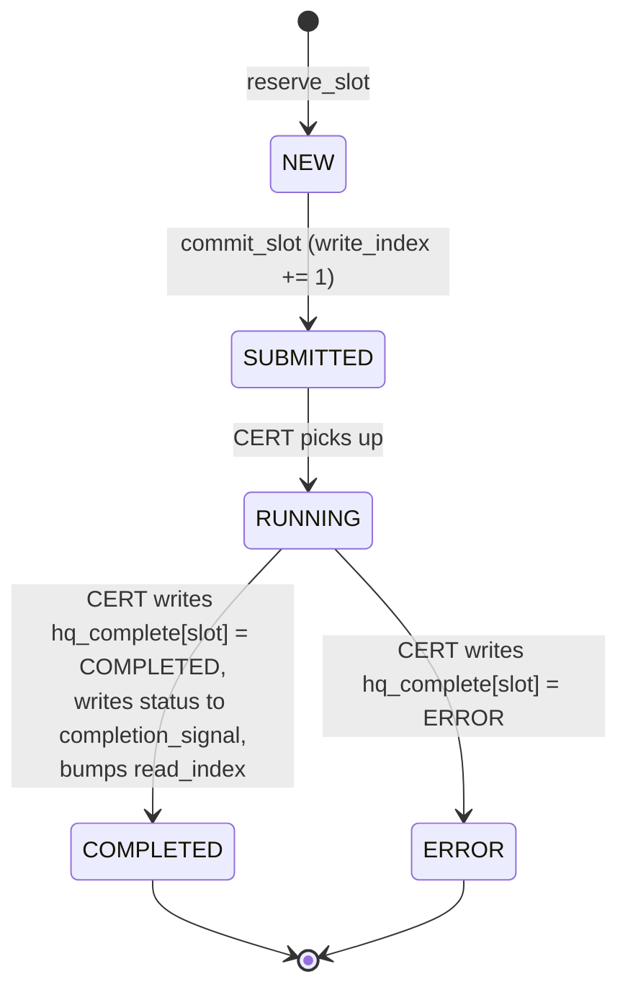
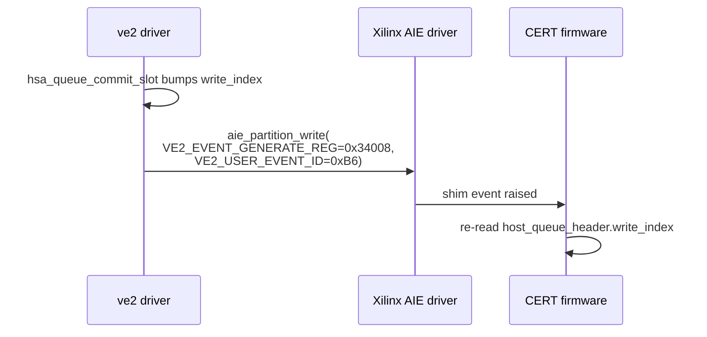
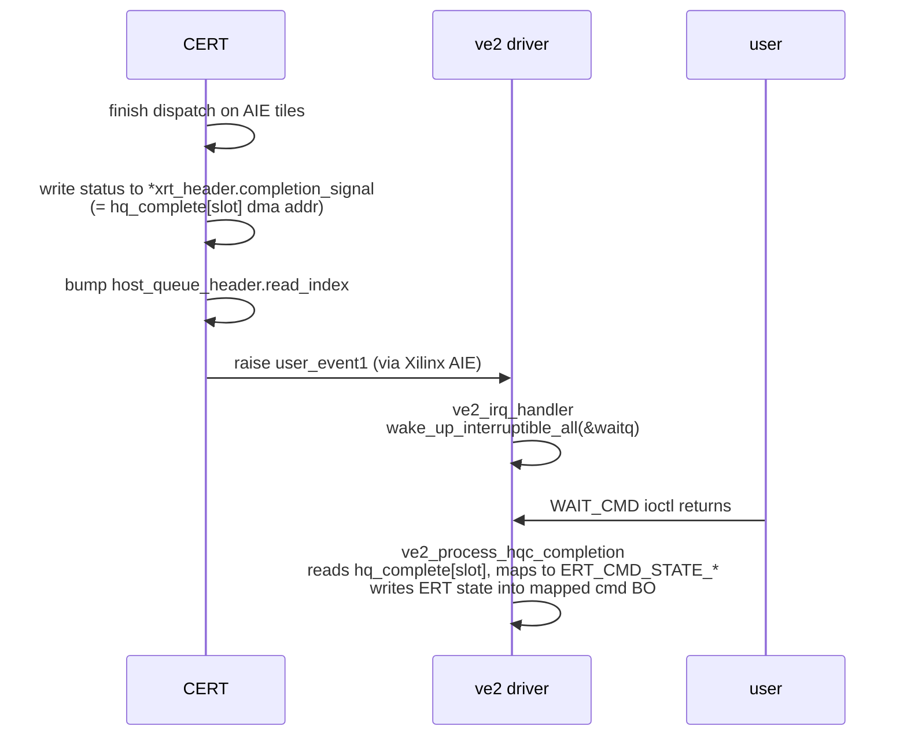
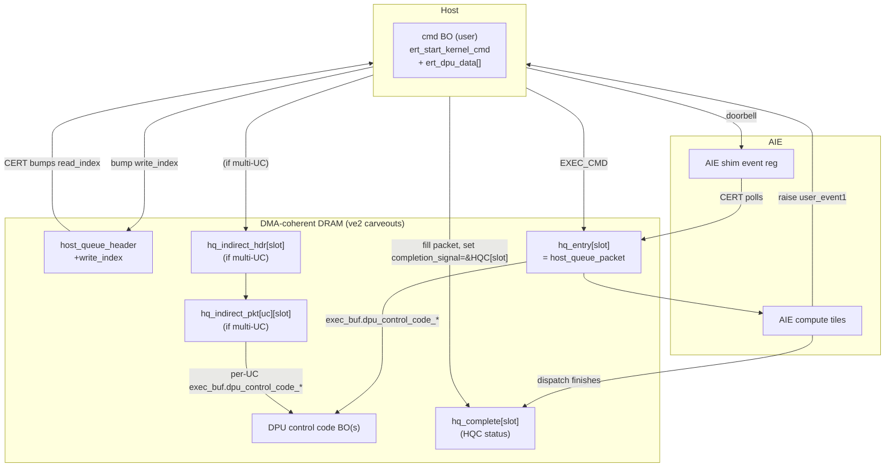

# 04 — HSA Queue Protocol

The "HSA queue" is the on-chip-visible ring buffer the host writes commands into and CERT consumes. Wire structures live in `src/driver/amdxdna/ve2_host_queue.h`.

## Top-level `struct hsa_queue`

```c
struct hsa_queue {
    struct host_queue_header        hq_header;
    struct host_queue_packet        hq_entry[HOST_QUEUE_ENTRY];          /* 32 */
    struct host_queue_indirect_hdr  hq_indirect_hdr[HOST_QUEUE_ENTRY];   /* 32 */
    struct host_queue_indirect_pkt  hq_indirect_pkt[HOST_INDIRECT_PKT_NUM][HOST_QUEUE_ENTRY]; /* 36 x 32 */
};
```

Allocated as one DMA-coherent block per hw_ctx (see [03-memory-model.md](./03-memory-model.md)). The kernel publishes its **device dma address** as `hsa_addr_high/low` in the CERT handshake region.



## `host_queue_header`

```c
struct host_queue_header {
    u64    read_index;     /* CERT writes; host reads */
    struct { u16 major; u16 minor; } version;
    u32    capacity;       /* HOST_QUEUE_ENTRY = 32 */
    u64    write_index;    /* host writes; CERT reads */
    u64    data_address;   /* device base of hq_entry[] */
};
```

- `write_index - read_index <= capacity` is the in-flight invariant.
- `read_index` and `write_index` are 64-bit, never wrap; slot index is `idx % capacity`.
- The host accesses these via `hsa_queue_sync_*` helpers (`ve2_mgmt.h`) that wrap `dma_sync_single_for_*` on the dma-coherent region.

## `host_queue_packet` (direct)

```c
struct common_header {
    union { struct { u16 type:8; u16 barrier:1;
                     u16 acquire_fence_scope:2;
                     u16 release_fence_scope:2; }; u16 header; };
    u8  opcode;       /* HOST_QUEUE_PACKET_EXEC_BUF = 1, ... */
    u8  chain_flag;   /* LAST_CMD = 0, NOT_LAST_CMD = 1 */
    u16 count;        /* size of inline payload */
    u8  distribute;
    u8  indirect;     /* 0 = data[] holds exec_buf, 1 = data[] holds indirect entry */
};

struct xrt_packet_header {
    struct common_header common_header;
    u64                  completion_signal;  /* dma addr where status word goes */
};

struct host_queue_packet {
    struct xrt_packet_header xrt_header;
    u32                      data[12];        /* either inline exec_buf or indirect entry */
};
```

- `completion_signal` is the **dma address of the corresponding HQC slot** (`hq_complete.hqc_dma_addr + slot*8`), not a user-space pointer. CERT writes the final status word there.
- `chain_flag` lets a single submission carry multiple packets — CERT keeps consuming until it sees `LAST_CMD`.

## `exec_buf` payload

This is the actual descriptor for "go run this DPU control code":

```c
struct exec_buf {
    u32 dtrace_buf_host_addr_low;
    u32 dpu_control_code_host_addr_low;
    u32 dpu_control_code_host_addr_high;
    u16 args_len;                        /* 0 today on ve2 */
    u16 dtrace_buf_host_addr_high;
    u32 args_host_addr_low;              /* 0 today on ve2 */
    u32 args_host_addr_high;             /* 0 today on ve2 */
};
```

For ve2 today, `args_len`/`args_host_addr_*` are zero — kernel arguments are patched into the control-code stream by `xrt::module`.

## Direct vs indirect submission



A multi-UC kernel (e.g. ELF spans columns 0..3 with 4 UCs) becomes:

- 1 `host_queue_packet` in `hq_entry[slot]` with `indirect=1` and one `host_indirect_packet_entry` in `data[]` pointing at `hq_indirect_hdr[slot]`.
- 1 `host_queue_indirect_hdr` in `hq_indirect_hdr[slot]` containing `N` entries.
- `N` `host_queue_indirect_pkt` slots, one per UC, each with its own `exec_buf`.

This expansion happens **in the kernel** in `ve2_hwctx.c::submit_command_indirect` (lines 583-681). The user-mode `ert_dpu_data` array (with `chained` set) is the input.

## Submit-side state machine (per slot)



The reserve/commit split exists so multiple producers can grab non-contiguous slots in parallel. `hsa_queue_commit_slot` only advances `write_index` past the lowest contiguous run of committed slots — the in-between reservations have to commit before `write_index` reaches them, otherwise CERT would see a hole.

## Doorbell



Code:

```1401:1411:src/driver/amdxdna/ve2_mgmt.c
int notify_fw_cmd_ready(struct amdxdna_ctx *hwctx)
{
	...
	ret = ve2_partition_write(hwctx->priv->aie_dev, 0, 0,
				  VE2_EVENT_GENERATE_REG, sizeof(u32),
				  (void *)&(value));
```

There is **no PCI BAR doorbell, no MSI-X, no RPMsg involved**. The doorbell is just an AIE shim CSR write proxied through the Xilinx AIE partition driver.

## Completion path



Two distinct status surfaces matter on completion:

1. **`hq_complete[]` ("HQC")** — kernel-private (well, CERT writes it through a known dma addr). The kernel reads it after wake to decide success/error.
2. **`ert` state in the user-mapped cmd BO** — this is what XRT polls in user space (e.g. `ert_state == COMPLETED`). The kernel's `amdxdna_cmd_set_state` writes here.

## Handshake region (kernel ↔ CERT control plane)

Separate from the HSA queue, there is a small per-column **handshake** struct in privileged AIE memory that the host fills at partition setup and the CERT firmware reads. Selected fields from `struct handshake` in `ve2_host_queue.h`:

| Field                       | Direction      | Purpose |
|-----------------------------|----------------|---------|
| `mpaie_alive`               | host → CERT    | Sync barrier: host signals "I'm here" |
| `cert_idle_status`          | CERT → host    | Used by `ve2_scheduler_work` to decide context switch |
| `runlist_read_idx`          | CERT → host    | Per-context progress when running multiple contexts |
| `hsa_addr_high/low`         | host → CERT    | Base DMA addr of the HSA queue (lead column only) |
| `log_addr/dbg_addr/trace_addr` | host → CERT | Per-column log/debug/trace BO dma addrs |
| `c_doorbell`, `c_hsa_pkt`   | CERT → host    | Counters for instrumentation |
| `misc_status`               | CERT → host    | Async exception/hang signaling |

The handshake is set by `cert_setup_partition` (`ve2_mgmt.c:42-69`) at hw_ctx create time and updated at config IOCTLs (debug-buffer attach etc.).

## What the wire actually carries (per submission)



This single picture is the whole "data plane" of ve2 submission. Everything else (xclbin caching, ELF parsing, arg patching, BO bookkeeping, drm_syncobj plumbing) is preparation.
